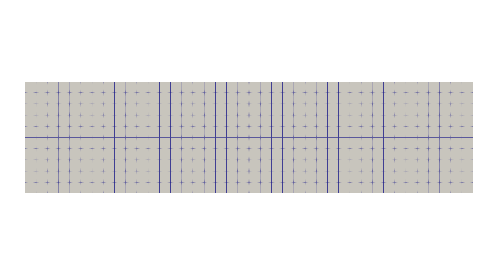

# Mesh Generation
A personal project to show my academic output and skillset.

## Cloning the Repository
To clone the repository,
```
git clone --recurse-submodules https://github.com/watf-dev/MeshGeneration.git
```
To add the directory to the PATH, for example,
```
echo 'export PATH=$PATH:/path/to/directory' >> ~/.zshrc
source ~/.zshrc
```

## Run
```
./run_2d.sh 5 20
```
- arg 1: the number of elements in x
- arg 2: the number of elements in y

## Visualization with ParaView
Example mesh with 5 elements in x and 20 elements in y;


