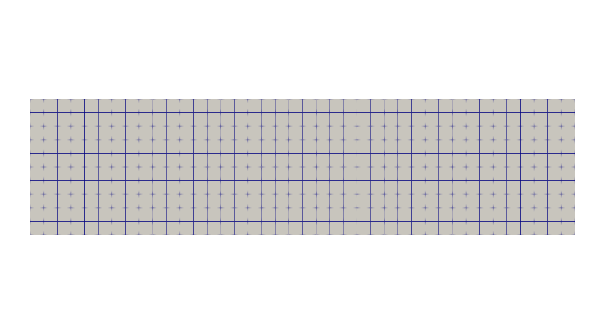
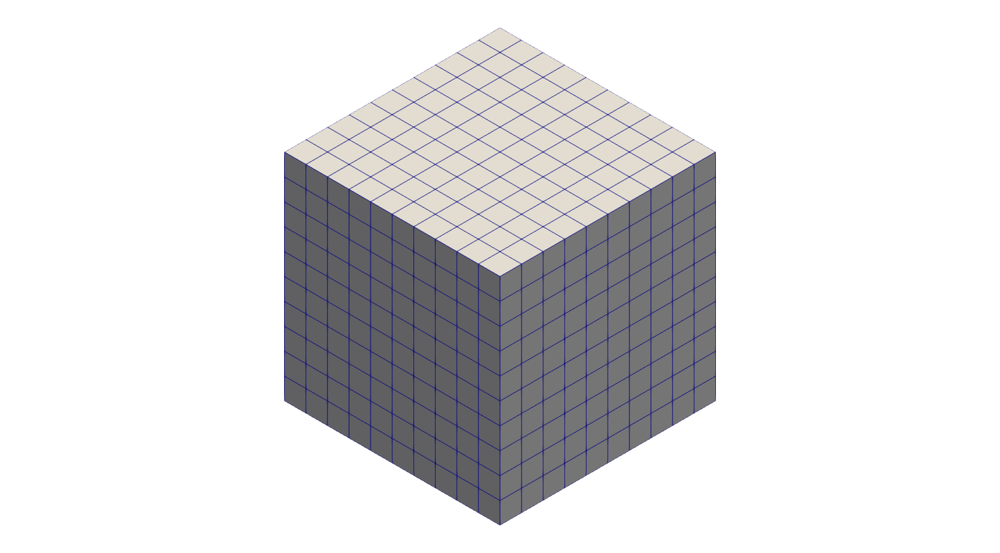

# Mesh Generation
A personal project to show my academic output and skillset.

## Cloning the Repository
To clone the repository,
```
git clone https://github.com/watf-dev/MeshGeneration.git
```

## Setting required modules
- [watfmesh](https://github.com/watf-dev/watfmesh)

- [watf.nurbs](https://github.com/watf-dev/watf/tree/main/nurbs)

To add the directory to the PATH, for example,
```
echo 'export PATH=$PATH:/path/to/directory' >> ~/.zshrc
source ~/.zshrc
```

## Example
Example 2D mesh with 40 elements in x and 10 elements in y;

Example 3D mesh with 10 elements in all directions;

Example mesh for cylinder test of CFD


